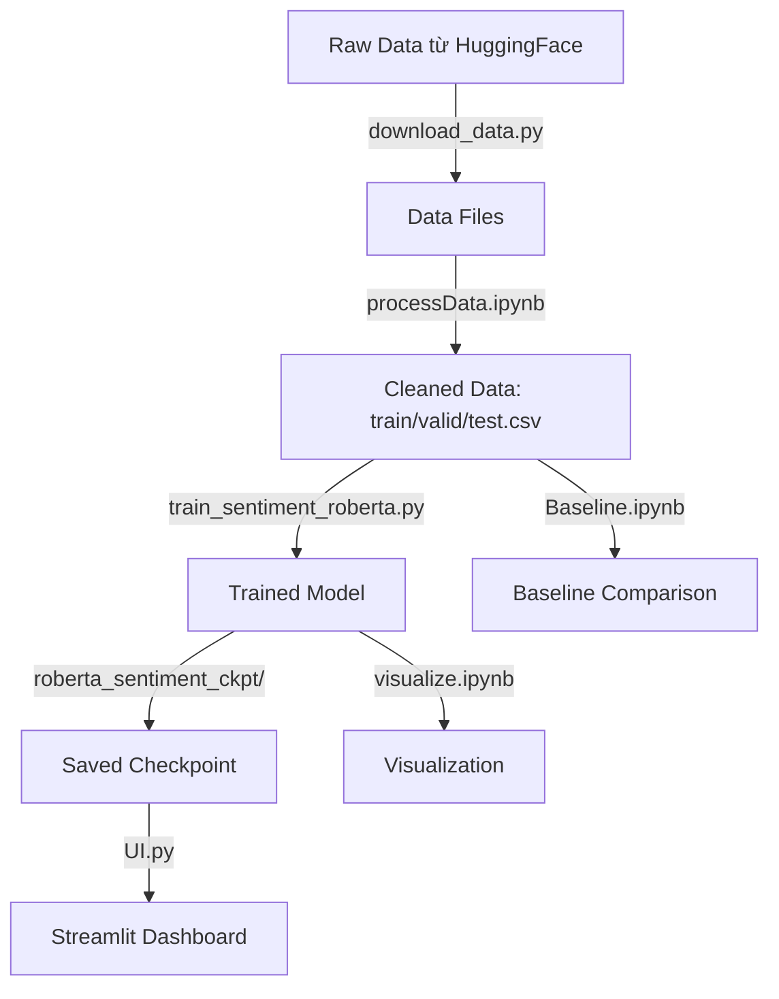

# 📚 Tài Liệu Hệ Thống - Sentiment Analysis với RoBERTa

## 📋 Tổng Quan Dự Án

Đây là hệ thống **phân tích cảm xúc đa lớp (Multi-class Sentiment Analysis)** sử dụng mô hình **RoBERTa** được fine-tune. Hệ thống được xây dựng cho mục đích luận văn với tên: *"Domain-focused Sentiment Analysis for Brand Monitoring using Pre-trained RoBERTa"*.

### 🎯 Mục Tiêu
- Phân loại văn bản thành **3 lớp cảm xúc**: Negative (0), Neutral (1), Positive (2)
- Đạt hiệu suất cao hơn các baseline truyền thống (Logistic Regression, SVM)
- Cung cấp giao diện web để demo và sử dụng

---

## 📁 Cấu Trúc Thư Mục

```
src/
├── train_sentiment_roberta.py    # Script huấn luyện model RoBERTa
├── UI.py                         # Giao diện Streamlit Dashboard
├── download_data.py              # Script tải dataset từ HuggingFace
├── Baseline.ipynb                # Notebook so sánh với Logistic Regression & SVM
├── processData.ipynb             # Notebook tiền xử lý dữ liệu
├── visualize.ipynb               # Notebook trực quan hóa kết quả
├── metrics.csv                   # Kết quả đánh giá model (đã train)
├── train.csv / valid.csv / test.csv  # Dữ liệu đã tiền xử lý
├── data/                         # Thư mục chứa raw data
│   ├── multiclass_sentiment_analysis_dataset_train.csv
│   ├── multiclass_sentiment_analysis_dataset_validation.csv
│   └── multiclass_sentiment_analysis_dataset_test.csv
└── roberta_sentiment_ckpt/       # Checkpoint model đã train
    ├── model_state_dict.pt       # Weights của model
    ├── train_config.json         # Config huấn luyện
    └── tokenizer/                # Tokenizer đã lưu
```

---

## 🔧 Chi Tiết Từng File

### 1. `train_sentiment_roberta.py` - Script Huấn Luyện

**Mục đích**: Fine-tune mô hình RoBERTa cho phân loại cảm xúc.

#### Các Class Chính:

| Class | Mô Tả |
|-------|-------|
| `TrainConfig` | Dataclass chứa cấu hình huấn luyện (model_name, epochs, learning rate, batch size, ...) |
| `SentimentDataset` | PyTorch Dataset để load và tokenize dữ liệu |
| `RobertaClassifier` | Model chính với kiến trúc: RoBERTa Encoder → Linear(768→768) → ReLU → Dropout → Linear(768→num_labels) |

#### Các Function Chính:

| Function | Mô Tả |
|----------|-------|
| `train_one_epoch()` | Huấn luyện 1 epoch, trả về loss và accuracy |
| `eval_model()` | Đánh giá model, tính toán các metrics (Accuracy, Precision, Recall, F1, ROC-AUC) |
| `save_artifacts()` | Lưu model weights, tokenizer, config |
| `write_metrics()` | Ghi kết quả đánh giá ra file |

#### Cách Sử Dụng:
```bash
python train_sentiment_roberta.py \
  --train_csv train.csv \
  --test_csv test.csv \
  --output_dir roberta_sentiment_ckpt \
  --metrics_txt metrics.txt \
  --epochs 3 \
  --lr 1e-5
```

#### Cấu Hình Mặc Định:
- **Model**: `cardiffnlp/twitter-roberta-base-sentiment`
- **Max Length**: 256 tokens
- **Batch Size**: Train=64, Eval=32
- **Epochs**: 3
- **Learning Rate**: 1e-5
- **Optimizer**: Adam

---

### 2. `UI.py` - Giao Diện Web Streamlit

**Mục đích**: Cung cấp dashboard trực quan để demo model.

#### Các Tính Năng:

1. **Nhập liệu**:
   - Nhập text thủ công (mỗi dòng 1 câu)
   - Upload file CSV/Excel

2. **Dự đoán**:
   - Xử lý theo batch để tránh OOM
   - Hiển thị progress bar và ETA
   - Tải xuống kết quả CSV

3. **Trực quan hóa**:
   - Biểu đồ tròn phân bố cảm xúc
   - Highlight các dự đoán confidence cao (>90%)

#### Cách Chạy:
```bash
streamlit run UI.py
```

#### Các Function Chính:

| Function | Mô Tả |
|----------|-------|
| `preprocess_data()` | Tự động nhận diện cột text trong file upload |
| `predict_sentiment()` | Dự đoán cho batch nhỏ |
| `predict_large_dataset()` | Dự đoán cho dataset lớn với progress tracking |

---

### 3. `download_data.py` - Tải Dataset

**Mục đích**: Tải dataset từ HuggingFace Hub.

**Dataset**: `Sp1786/multiclass-sentiment-analysis-dataset`

**Output**:
- `data/multiclass_sentiment_analysis_dataset_train.csv`
- `data/multiclass_sentiment_analysis_dataset_validation.csv`
- `data/multiclass_sentiment_analysis_dataset_test.csv`

---

### 4. `Baseline.ipynb` - So Sánh Baseline

**Mục đích**: So sánh hiệu suất RoBERTa với các mô hình truyền thống.

#### Các Mô Hình Được So Sánh:

| Model | Accuracy | Macro F1 |
|-------|----------|----------|
| Logistic Regression + TF-IDF | 68.61% | 0.69 |
| SVM + TF-IDF | 68.00% | 0.68 |
| **RoBERTa (Fine-tuned)** | **72.17%** | **0.72** |

#### Pipeline TF-IDF:
- Lowercase: True
- N-grams: (1, 2)
- Max features: 10,000
- Sublinear TF: True

---

## 📊 Kết Quả Đánh Giá Model

### Cấu Hình Huấn Luyện:
```json
{
  "model_name": "cardiffnlp/twitter-roberta-base-sentiment",
  "num_labels": 3,
  "max_len": 256,
  "train_batch_size": 64,
  "epochs": 3,
  "lr": 1e-05
}
```

### Lịch Sử Huấn Luyện:
| Epoch | Train Loss | Train Accuracy |
|-------|------------|----------------|
| 1 | 0.7100 | 69.32% |
| 2 | 0.6266 | 73.29% |
| 3 | 0.5731 | 76.18% |

### Metrics Trên Test Set:

| Metric | Giá Trị |
|--------|---------|
| **Accuracy** | 72.17% |
| **Precision (macro)** | 72.11% |
| **Recall (macro)** | 72.32% |
| **F1-score (macro)** | 72.16% |
| **ROC-AUC (OvR, macro)** | 87.91% |

### Classification Report:
| Class | Precision | Recall | F1-Score | Support |
|-------|-----------|--------|----------|---------|
| 0 (Negative) | 0.7473 | 0.7328 | 0.7399 | 1029 |
| 1 (Neutral) | 0.6534 | 0.6154 | 0.6339 | 1204 |
| 2 (Positive) | 0.7627 | 0.8214 | 0.7909 | 1170 |

---

## 🔄 Quy Trình Làm Việc



---

## 📝 Kiến Trúc Model RoBERTa Classifier

```
Input Text
    │
    ▼
┌─────────────────────────────────┐
│      RobertaTokenizerFast       │
│   (max_length=256, padding)     │
└─────────────────────────────────┘
    │
    ▼
┌─────────────────────────────────┐
│        RobertaModel             │
│  (cardiffnlp/twitter-roberta-   │
│   base-sentiment)               │
└─────────────────────────────────┘
    │
    ▼ [CLS] token embedding (768-dim)
    │
┌─────────────────────────────────┐
│   Pre-Classifier (768 → 768)    │
│          + ReLU                 │
│       + Dropout(0.2)            │
└─────────────────────────────────┘
    │
    ▼
┌─────────────────────────────────┐
│    Classifier (768 → 3)         │
│         (num_labels)            │
└─────────────────────────────────┘
    │
    ▼
┌─────────────────────────────────┐
│       Softmax → Logits          │
│  [Negative, Neutral, Positive]  │
└─────────────────────────────────┘
```

---

## 🚀 Hướng Dẫn Cài Đặt & Sử Dụng

### Yêu Cầu:
```txt
torch
transformers
pandas
numpy
scikit-learn
streamlit
plotly
tqdm
datasets
```

### Các Bước:

1. **Tải dữ liệu**:
   ```bash
   python download_data.py
   ```

2. **Tiền xử lý dữ liệu**: Chạy `processData.ipynb`

3. **Huấn luyện model**:
   ```bash
   python train_sentiment_roberta.py \
     --train_csv train.csv \
     --test_csv test.csv
   ```

4. **Chạy Dashboard**:
   ```bash
   streamlit run UI.py
   ```

---

## 📌 Ghi Chú Quan Trọng

1. **GPU**: Script tự động detect CUDA, nếu có sẽ dùng GPU
2. **Memory**: UI sử dụng batch processing để tránh OOM
3. **Columns**: Data cần có `text_clean` và `label`
4. **Labels**: 0=Negative, 1=Neutral, 2=Positive

---

*Tài liệu được tạo tự động bởi AI Assistant - Cập nhật: 2025-12-30*
